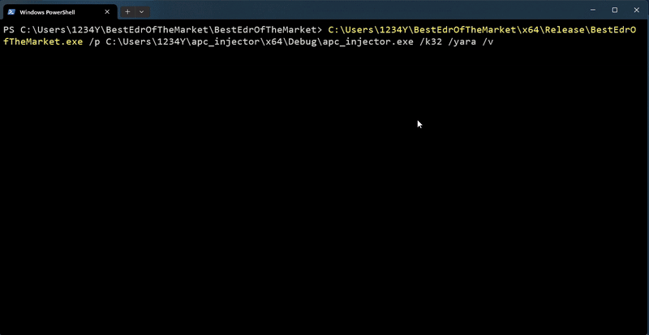
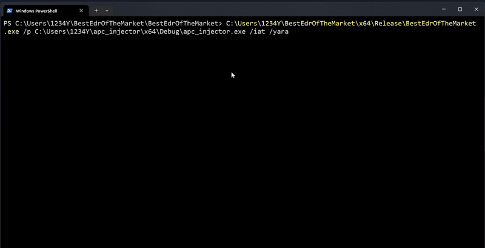
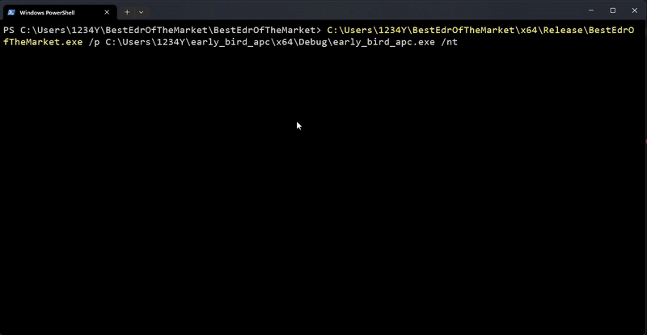
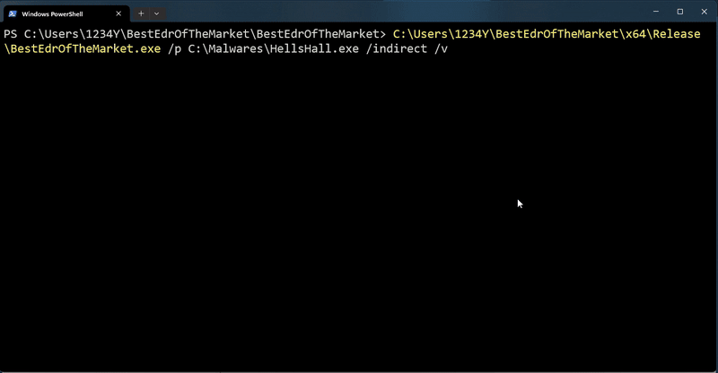
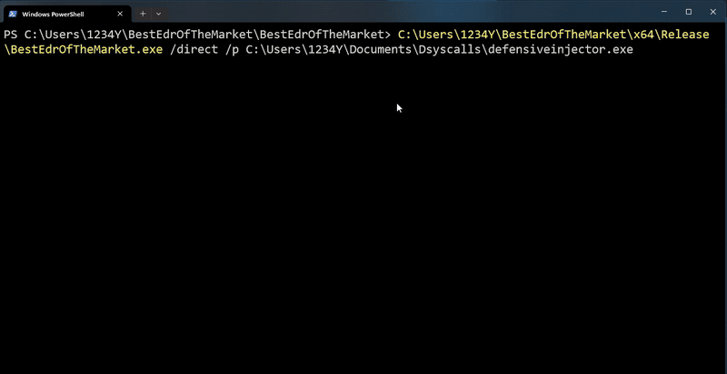
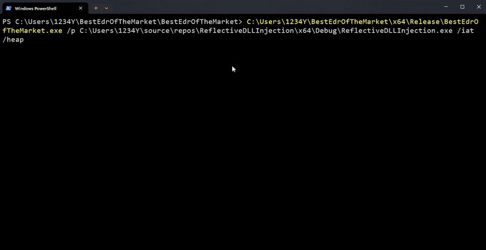
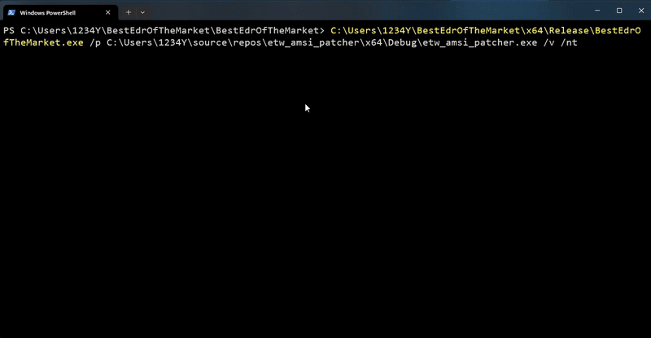


# <a href="https://xacone.github.io/BestEdrOfTheMarket.html"> Best EDR Of The Market (BEOTM) 🐲 </a>
<i>Little AV/EDR Evasion Lab for training & learning purposes.</i> (🏗️ under construction..)​


<br>BestEDROfTheMarket is a naive user-mode EDR (Endpoint Detection and Response) project, designed to serve as a testing ground for understanding and bypassing EDR's user-mode detection methods that are frequently used by these security solutions.
<br>These techniques are mainly based on a dynamic analysis of the target process state (memory, API calls, etc.), 

<!-- <a href="https://xacone.github.io/BestEdrOfTheMarket.html"><b>- Introducing the Best EDR Of The Market Project</b></a><br> -->
<a href="https://xacone.github.io/BestEdrOfTheMarketV2.html"><b>➡️ What's new in Best EDR Of The Market v1.1.0 🏹</b></a>

## Defensive Techniques ⚔️​
- [x] <a href="#"> NT-Level API Hooking </a> <br>
- [x] <a href="#"> Kernel32/Base API Hooking </a> <br>
- [x] <a href="#"> Active Response w/ YARA rules or simple patterns </a> <br>
- [x] <a href="#"> IAT Hooking </a> <br>
- [x] <a href="#"> Threads Call Stack Monitoring (Stacked parameters + Unbacked addresses) </a> <br>
- [x] <a href="#"> Heap Regions Analysis </a> <br>
- [x] <a href="#"> Direct Syscalls Detection </a> <br>
- [x] <a href="#"> Indirect Syscalls Detection </a> <br>
- [x] <a href="#"> AMSI/ETW Patching Mitigation </a> <br>
<!-- - [x] <a href="#"> SSN Hooking/Crushing <i>(fantasy)</i></a> <br> -->


<i>In progress</i>:
- [ ] <a href="#"> Proper Threads Creation Monitoring </a> <br>
- [ ] <a href="#"> AMSI Scanning </a> <br>

<details>
    <summary><b>List of hooks 🪝</b></summary>
          <h4>NTDLL hooks (More hooks on road..)</h4>
                          <br>
                            <table style="font-size: 14px;">
                            <tr>
                                <th>Function</th>
                                <th>Description</th>
                            </tr>
                            <tr>
                                <td>NtProtectVirtualMemory</td>
                                <td>Change the protection on a region of committed pages in the virtual address space of a process using native API.</td>
                            </tr>
                            <tr>
                                <td>NtWriteVirtualMemory</td>
                                <td>Write data to the memory of a specified process using native API.</td>
                            </tr>
                            <tr>
                                <td>NtMapViewOfSection</td>
                                <td>Create a view of a section of a file mapping into the address space of the calling process using native API.</td>
                            </tr>                          
                          </table>

<h4>Kernel32/Base hooks</h4><br>
                          <table style="font-size: 14px;">
                            <tr>
                              <th>Function</th>
                              <th>Description</th>
                            </tr>
                            <tr>
                              <td>VirtualAlloc</td>
                              <td>Allocate memory in the virtual address space of a process.</td>
                            </tr>
                            <tr>
                              <td>WriteProcessMemory</td>
                              <td>Write data to the memory of a specified process.</td>
                            </tr>
                            <tr>
                              <td>VirtualFree</td>
                              <td>Release or decommit a region of memory previously allocated.</td>
                            </tr>
                            <tr>
                              <td>VirtualFreeEx</td>
                              <td>Release or decommit a region of memory in a specified process.</td>
                            </tr>
                            <tr>
                              <td>VirtualProtect</td>
                              <td>Change the protection on a region of committed pages in the virtual address space of a process.</td>
                            </tr>
                            <tr>
                              <td>MapViewOfFile</td>
                              <td>Create a view of a file mapping into the address space of the calling process.</td>
                            </tr>
                            <tr>
                              <td>VirtualProtectEx</td>
                              <td>Change the protection on a region of committed pages in the virtual address space of a specified process.</td>
                            </tr>
                            <tr>
                              <td>UnmapViewOfFile</td>
                              <td>Unmap a mapped view of a file from the calling process's address space.</td>
                            </tr>
                            <tr>
                              <td>VirtualQuery</td>
                              <td>Retrieve information about a range of pages in the virtual address space of a specified process.</td>
                            </tr>
                            <tr>
                              <td>ReadProcessMemory</td>
                              <td>Read data from the memory of a specified process.</td>
                            </tr>
                            <tr>
                              <td>InternetOpenUrlW</td>
                              <td>Opens a URL for reading on the internet.</td>
                            </tr>
                            <tr>
                              <td>InternetReadFile</td>
                              <td>Reads data from a handle opened by the InternetOpenUrl or InternetOpenUrlW function.</td>
                            </tr>
                            <tr>
                              <td>InternetReadFileExW</td>
                              <td>Reads data from a handle opened by the InternetOpenUrl or InternetOpenUrlW function, and can also return additional data.</td>
                            </tr>
                            <tr>
                              <td>InternetOpenW</td>
                              <td>Initializes an application's use of the WinINet functions.</td>
                            </tr>
                          </table>
                          
                    
   <h4>Import Address Table (IAT) Hooks</h4><br>

<table style="font-size: 14px;">
<tr>
    <th>Function Name</th>
    <th>Purpose</th>
  </tr>
  <tr>
    <td>WriteProcessMemory</td>
    <td>Writes data to an area of memory in a specified process</td>
  </tr>
  <tr>
    <td>ReadProcessMemory</td>
    <td>Reads data from an area of memory in a specified process</td>
  </tr>
  <tr>
    <td>VirtualAlloc</td>
    <td>Reserves or commits a region of memory within the virtual address space of a process</td>
  </tr>
  <tr>
    <td>VirtualAllocEx</td>
    <td>Reserves or commits a region of memory within the virtual address space of a specified process</td>
  </tr>
  <tr>
    <td>VirtualProtect</td>
    <td>Changes the access protection for a region of committed pages in the virtual address space of the calling process</td>
  </tr>
  <tr>
    <td>HeapAlloc</td>
    <td>Allocates a block of memory from a heap</td>
  </tr>
  <tr>
    <td>HeapFree</td>
    <td>Frees a memory block allocated from a heap</td>
  </tr>
  <tr>
    <td>LoadLibraryA</td>
    <td>Loads the specified module into the address space of the calling process</td>
  </tr>
  <tr>
    <td>LocalFree</td>
    <td>Frees the specified local memory object and invalidates its handle</td>
  </tr>
  <tr>
    <td>VirtualQuery</td>
    <td>Retrieves information about a range of pages in the virtual address space of a specified process</td>
  </tr>
  <tr>
    <td>InternetOpenW</td>
    <td>Initializes an application's use of the WinINet functions</td>
  </tr>
  <tr>
    <td>InternetOpenUrlW</td>
    <td>Opens a URL</td>
  </tr>
  <tr>
    <td>InternetReadFile</td>
    <td>Reads data from a handle opened by the InternetOpenUrl or InternetOpenUrlEx function</td>
  </tr>
  <tr>
    <td>VirtualProtectEx</td>
    <td>Changes the protection on a region of committed pages in the virtual address space of a specified process</td>
  </tr>
</table>
</details>

## Usage 📜
```
Usage: BestEdrOfTheMarket.exe [args]


      /help : Shows this help message and quit
      /v : Verbosity  
      /p : Target process path (PID required if not specified)
      /yara : Enabling scanning YARA rules canning
      /iat : IAT hooking
      /stack : Threads call stack monitoring
      /nt : Inline Nt-level hooking
      /k32 : Inline Kernel32/Kernelbase hooking
      /ssn : SSN crushing
      /direct : Direct syscalls detection
      /indirect : Indirect syscalls detection
      /heap : Enabling heap regions analysis (to use with /iat, /k32 or /nt)

```

## Examples⚡

<details>
  <summary><b>Low-Level Shellcode Injector Detection (Stack analysis + YARA)</b></summary>
  <br>

  ```
  BestEdrOfTheMarket.exe /stack /p C:\Samples\MediumLevelDropper.exe /yara /v
  ```

  
  <br><br>
  
</details>


<details>
  <summary><b>Early Bird APC Queue Injector detection (Kernel32 hooking + Normal patterns)</b></summary>
 <br>

  ```
  BestEdrOfTheMarket.exe /p C:\Samples\apc_injector.exe /k32 /yara /v
  ```

  
  <br><br>

</details>


<details>
  <summary><b>Early Bird  APC Queue Injector detection (IAT hooking + YARA)</b></summary>
 <br>

  ```
  BestEdrOfTheMarket.exe /p C:\Users\1234Y\apc_injector\x64\Debug\apc_injector.exe /iat /yara
  ```

  
  <br><br>


</details>


<details>
  <summary><b>Low level Early Bird APC Queue Injector detection (NT-level hooking + Normal patterns)</b></summary>
     <br>

  ```
  BestEdrOfTheMarket.exe /p C:\Samples\low_level_apc_inector.exe /nt
  ```

  
  <br><br>


</details>

<details>
  <summary><b>Indirect Syscalls Detection (Stack pointer sanity check)</b></summary>

<br>
  <a href="https://github.com/Maldev-Academy/HellHall">Hell's Hall (@Maldev-Academy) Github repository</a>
 <br><br>

  ```
  BestEdrOfTheMarket.exe /p C:\Malwares\HellsHall.exe /indirect /v
  ```

  
  <br><br>


</details>


<details>
  <summary><b>Direct Syscalls Detection (Instruction pointer sanity check)</b></summary>

<br>
<a href="https://github.com/bats3c/DefensiveInjector">DenfensiveInjector (@bats3c) Github repository</a>
 <br>

  <br>

  ```
  BestEdrOfTheMarket.exe /direct /p C:\Malwares\defensiveinjector.exe
  ```

  
  <br><br>

</details>

<details>
  <summary><b>Reflective DLL Injector (Heap analysis + YARA)</b></summary>
  
  <br>

  ```
  BestEdrOfTheMarket.exe /p C:\Malwares\ReflectiveDLLInjection.exe /iat /heap
  ```

  
  <br><br>

</details>

<details>
  <summary><b>AMSI Patcher detection</b></summary>

  <br>

  ```
  BestEdrOfTheMarket.exe /p C:\Malwares\etw_amsi_patcher.exe /v /nt
  ```

  
  <br><br>
  

</details>


<br>
<!--<a href="#"> Performance brief </a> <br>-->

<!---->


## Structure & Config files ⚙️
```text
📁 BestEdrOfTheMarket/
    📄 BestEdrOfTheMarket.exe
    📁 DLLs/
        📄 KerneI32.dll
        📄 ntdII.dll
        📄 iat.dll
        📄 callbacks.dll
        📄 magicbp.dll
    📁 YARA/
        📄 Metasploit_Artefacts_Rule.yara
        📄 ...
    📝 YaroRules.json
    📄 jsoncpp.dll
    📄 libcrypto-3-x64.dll
```

<b>YaroRules.json: </b>Contains a json array filled with the simple/normal (not Yara) patterns you would like to be identified through the defensive mechanisms.
```json
{
	"StackPatterns": [
		"40 53 48 83 EC 90 65 48 8B 04",
    "..."
	],
	"HeapPatterns": [
		"4D 5A 90 00 03 00 00 00 04 00 00 00 FF FF 00 00 B8 00 00 00 00",
    "..."
    ],
	"DllHookingPatterns": [
		"59 61 7A 69 64 6F 75",
    "..."
	],
	"GeneralPatterns": [
		"FC E8 82 00 00 00 60 89 E5 31 C0 64 8B 50",
		"..."
	]	
}		
```

## <a href="https://github.com/Xacone/BestEdrOfTheMarket/releases/tag/Beta">Releases</a> 📦

## <a href="Docs/Setup.md"> Project Setup </a> 

## Disclaimer ⚠️​
- There's no interest in mixing the defensive methods or in putting them all (`/nt` + `/stack` + `/k32` + /blahblah) as you may encounter crashes due to conflicts beetwen them, especially for low level hooks. Activate the one you want depending on your needs. 

- Don't link the EDR to programs that are too CPU-intensive/thread-creating, as some detection techniques such as call stack analysis constantly monitor the stack state of each thread and this can quickly increase the load on the EDR, it's more relevant (that's also the point) that you link the tool to your own artifacts and keep in mind that a good evasive artifact tries to be as discrete as possible.
