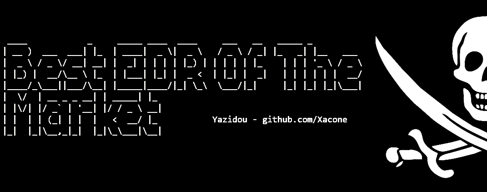


# <a href="https://xacone.github.io/BestEdrOfTheMarketV3.html"> Best EDR Of The Market (BEOTM) V3 🐲🏴‍☠️ </a>

 

Best Edr Of The Market is an open-source lab designed to implement and understand, from a low-level perspective, the detection methods used by Endpoints Detection & Response security products and their workarounds. These techniques are mainly based on the exploitation of Windows NT's telemetric capabilities to dynamically analyze process behavior.

<h2>Defensive Capabilities</h2>
This current version (v3) focuses on some of the interception capabilities offered by the Windows kernel. These include

- [x] <a href="#"> System Calls Interception via Alternative System Call Handlers  </a> 
- [x] <a href="#"> 
Exploitation of the Virtual Address Descriptor (VAD) Tree for Image Integrity Checking  </a> 
- [x] <a href="#"> Leverage of the Shadow Stack to Verify Thread Call Stacks Integrity </a> 
- [x] <a href="#"> Using kernel callbacks to capture events related to thread creation, process creation, image loading into memory, registry operations, and object operations. </a> 

